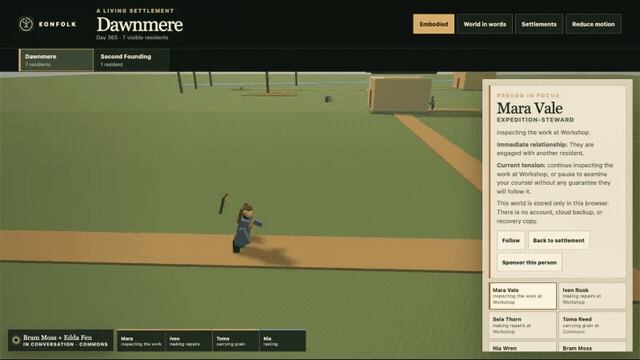
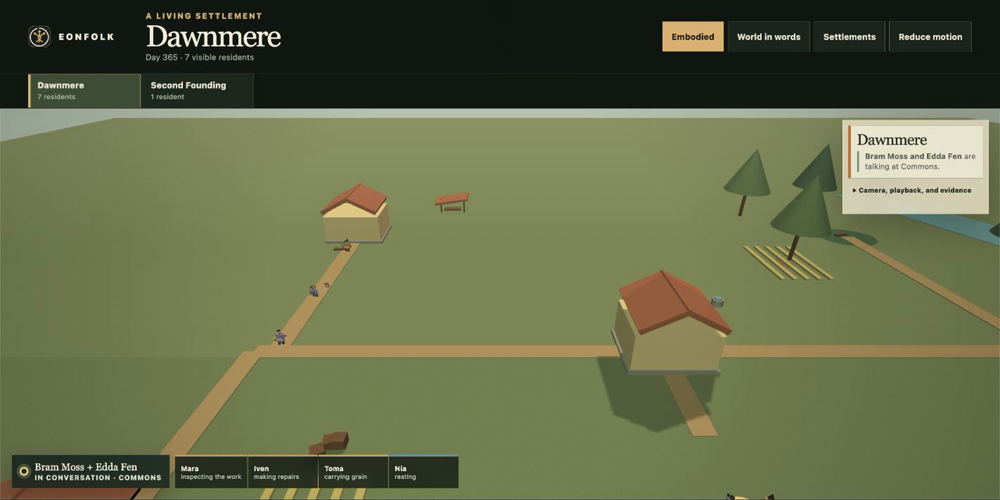
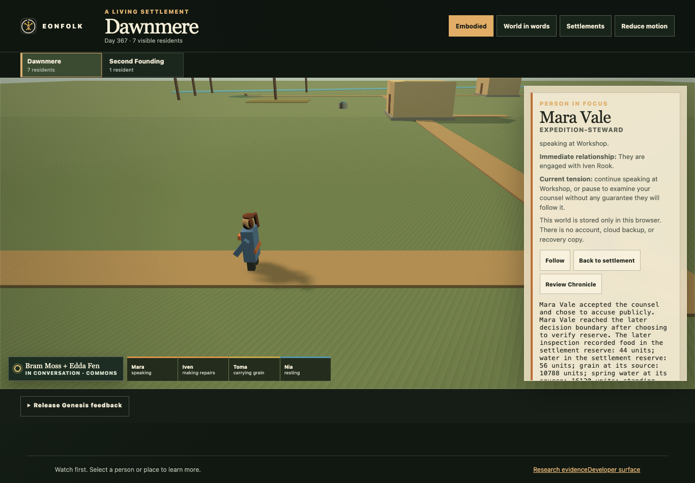

# EONFOLK


EONFOLK is an experimental, local-first civilization game. You follow one
person inside a persistent settlement, offer rare high-level counsel, and watch
them accept, reject, delay, or reinterpret it. The Chronicle then separates
what happened from what people believed and who merely set events in motion.

Citizens can be wrong. You can be wrong. Optional local models, if you enable
them, can be nondeterministic. Canonical Reality is still deterministic and
replayable: cognition, UI, and narration may propose or describe, but they
cannot write the world.

> **Project status: pre-alpha.** The current build is a bounded product proof,
> not a finished or hosted game. It runs locally, requires no account or model,
> and stores its world in your browser.



[Watch the 15-second MP4](docs/media/eonfolk-sponsor-loop.mp4) ·
[Capture provenance](docs/media/README.md)

## What you can play today

- Explore a generated region and inhabited settlement at region, town, and
  citizen camera scales.
- Observe eight autonomous citizens gathering, carrying, repairing, trading,
  meeting, and responding to social pressure.
- Sponsor Mara in under a minute and give one consequential piece of counsel—or
  deliberately abstain.
- See Mara independently accept, reject, delay, or reinterpret the intervention.
- Leave, reload, catch up, and replay the durable consequence.
- Inspect a factual Chronicle that distinguishes direct cause, trigger,
  contributing condition, temporal order, and allegation.
- Use every important action through semantic keyboard controls, including a
  playable non-WebGL fallback.

The build does **not** include accounts, networking, deployment, payments,
multiplayer, unrestricted dialogue, model downloads, or a generalized economy.
Those are not hidden prerequisites.

## Quick start

Requirements:

- macOS or Linux
- Node.js 22.23.1
- pnpm 11.15.1 through Corepack
- a current Chromium-family browser with WebGL2; the semantic world remains
  playable when WebGL is unavailable

```sh
corepack enable
corepack pnpm install --frozen-lockfile --ignore-scripts
corepack pnpm dev
```

Open the loopback URL printed by Vite. `/` is the landing page; `/world` is the
settlement. To complete the product loop locally: enter Dawnmere, choose
**Follow Mara**, choose **Sponsor Mara**, then either offer counsel or abstain.
Watch her independent response and read the Chronicle.

No command deploys or publishes the project. For a 10–20 minute session with
another person, use the [playtest kit](docs/playtesting/README.md). That kit
does not collect data over the network.

For a production-mode local run:

```sh
corepack pnpm prod
```

## The product loop

```text
observe the world
       ↓
understand one citizen's facts, beliefs, and tension
       ↓
counsel or abstain
       ↓
the citizen decides independently
       ↓
the settlement changes
       ↓
return to a factual Chronicle and choose the next risk
```

The player does not puppeteer a worker. The central tension is whether a person
with incomplete knowledge will treat the player's intervention as useful,
premature, self-serving, or irrelevant—and what the world will remember.





## Architecture at a glance

```text
React + semantic DOM + PlayCanvas world
                    │
             application validation
           ┌────────┴────────┐
           │                 │
   deterministic worker   IndexedDB
   Reality + scheduler     events, receipts,
   + Standard Brain        snapshots, replay
           │
   immutable projections
           │
   world, Chronicle, diagnostics
```

Reality is the sole authority. Cognition proposes one typed action; validation
accepts or rejects it atomically. Rendering, diagnostics, feedback, and prose
cannot mutate the world. Canonical replay uses only versioned snapshots and
accepted events, so the game remains complete without an LLM.

Read [Architecture](docs/ARCHITECTURE.md) for boundaries and
[Gameplay](docs/GAMEPLAY.md) for the current rules.

## Privacy and data

The current world, feedback drafts, and diagnostic captures stay in local
browser storage. EONFOLK has no telemetry, account system, analytics relay, or
server persistence. Clearing site data removes the local world. There is not yet
a supported backup/import workflow, so do not treat a pre-alpha world as durable
personal storage.

Optional model experiments are isolated from authoritative state and are not
part of normal onboarding or required verification.

## Quality

The repository checks formatting, lint, strict TypeScript, unit tests,
deterministic and property tests, IndexedDB behavior, builds, browser journeys,
network isolation, accessibility, payload/frame budgets, fault recovery,
replay, model-free progress, and a bounded TLA+ persistence model.

```sh
corepack pnpm verify:fast
corepack pnpm exec playwright install chromium
TLA2TOOLS_JAR=/absolute/path/to/tla2tools.jar corepack pnpm verify:pr
```

Java 21 and a verified `tla2tools.jar` are required only for the formal PR/deep
tiers. See [Testing](docs/TESTING.md), [Accessibility](docs/ACCESSIBILITY.md), and
[Performance](docs/PERFORMANCE.md).

## Project map

| Path | Responsibility |
|---|---|
| `apps/web` | browser application, local worker orchestration, world and Chronicle |
| `packages/protocol` | versioned identifiers, commands, events, visibility |
| `packages/sim` | pure authoritative transitions, invariants, replay |
| `packages/civilization` | bounded society state and deterministic scheduler |
| `packages/cognition` | Standard Brain and untrusted proposal boundary |
| `packages/persistence` | memory and IndexedDB event/snapshot adapters |
| `packages/worldgen` | deterministic region generation |
| `packages/world-presentation` | renderer-neutral spatial projections |
| `packages/diagnostics` | redacted, non-authoritative local observation |
| `formal` | bounded persistence specification |
| `tests` | unit, property, timing, browser, fault, and model experiments |

## Contributing and support

Start with [Development](docs/DEVELOPMENT.md) and
[Contributing](CONTRIBUTING.md). Please use the issue forms for bugs, gameplay
feedback, accessibility/performance reports, and scoped proposals. Security
reports follow [SECURITY.md](SECURITY.md); general help is in
[SUPPORT.md](SUPPORT.md).

The near-term direction is in [ROADMAP.md](ROADMAP.md). Local human sessions
use the [playtest kit](docs/playtesting/README.md). Changes are recorded in
[CHANGELOG.md](CHANGELOG.md), and third-party components are documented in
[THIRD_PARTY_NOTICES.md](THIRD_PARTY_NOTICES.md).

## Current limitations

- One local generated region and one sponsor storyline are deeply exercised;
  content breadth and long-term player attachment remain unproven.
- Browser storage has no supported backup, import, sync, or conflict merge.
- Mobile behavior is tested through deterministic browser profiles; broad
  physical-device coverage is still limited.
- The world is deliberately small: eight active citizens by default and twelve
  as a practical first-slice ceiling.
- Public hosting, shared canon, moderation, and accounts require a separate
  security and operations design.

EONFOLK is an experiment in understandable autonomy, not a claim of sentience.

## License

Original source code, tests, configuration, and documentation are available
under the [Apache License 2.0](LICENSE). The EONFOLK name/mark and specified
creative assets are reserved; dependency and asset details are in
[THIRD_PARTY_NOTICES.md](THIRD_PARTY_NOTICES.md).
